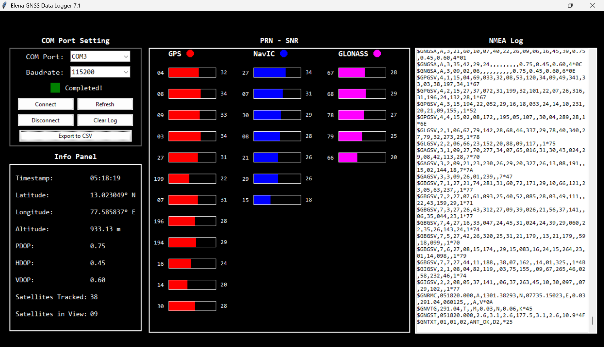

# Elena GNSS Data Logger

A real-time GNSS data logger built with Python and Tkinter that parses live NMEA sentences from a GPS receiver and displays satellite data.

## Technologies Used
- Python 3.13
- Tkinter (GUI)
- Threading
- CSV

## Features
- Live NMEA sentence parsing from GPS receiver
- Real-time SNR bar chart for GPS, NavIC and GLONASS satellites
- Info panel showing Timestamp, Latitude, Longitude, Altitude, PDOP, HDOP, VDOP
- Satellites tracked and in view count
- Export collected data to CSV
- Connect, Disconnect, Refresh and Clear Log controls

## How to Run
1. Clone the repo
2. Place your NMEA log file as `Nmea.txt` in the project folder
3. Run the app

## GUI Preview
