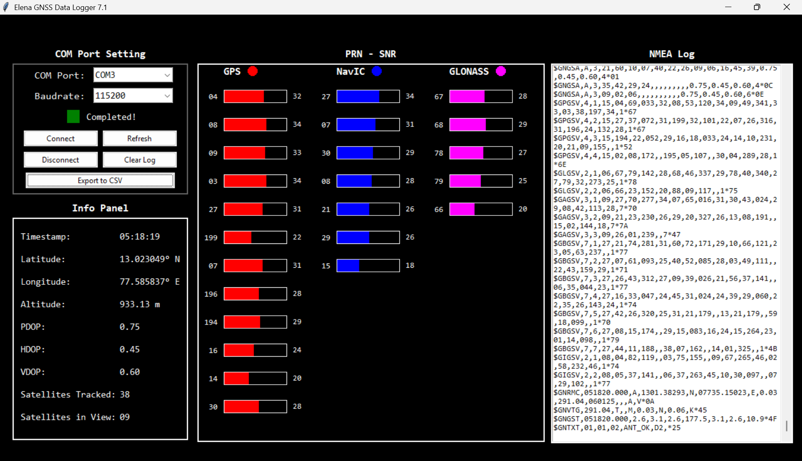

# Elena GNSS Data Logger 7.1

*A Study on Python-Based Parsing and Visualization of Location Data for the NavIC Data Viewer Application*

A real-time GNSS Data Logger developed using **Python** and **Tkinter** that parses NMEA sentences from a live GNSS receiver or a recorded NMEA log file, extracts satellite and positioning information, and visualizes them through an interactive graphical user interface.

---

## 🖼️ GUI Preview




---
## 📖 Overview

This project was developed during my internship at **Elena Geo Tech Pvt. Ltd.** as part of the study **"Python-Based Parsing and Visualization of Location Data for the NavIC Data Viewer Application."**

The application parses standard GNSS NMEA sentences, extracts positioning and satellite information, and presents them through an interactive desktop interface built with Tkinter.

The original implementation communicated with a **live GNSS receiver** through serial communication. For academic demonstration and easier portability, this repository replays a recorded **`Nmea.txt`** file while preserving the same parsing, visualization, and data-processing workflow.

---

## ✨ Features

- Parses NMEA sentences from a live GNSS receiver or a recorded NMEA log file
- Displays Latitude, Longitude, Altitude, and Timestamp
- Converts UTC time to IST
- Displays PDOP, HDOP, and VDOP values
- Displays Satellites Tracked and Satellites in View
- Visualizes real-time PRN–SNR data for GPS, NavIC, and GLONASS satellites
- Exports parsed data to CSV
- Provides Connect, Disconnect, Refresh, and Clear Log controls
- Interactive Tkinter-based graphical user interface
- Displays a live NMEA Log Viewer
- Handles invalid or incomplete NMEA data gracefully

---

## 🛠️ Technologies Used

- Python 3.13
- Tkinter (GUI Development)
- Threading (Real-time Processing)
- CSV (Data Export)


---

## 📂 Project Structure

```text
Elena-GNSS_Data_Logger/
│
├── .gitignore
├── main.py
├── Nmea.txt
├── output_screenshot.png
├── README.md
├── requirements.txt
└── gnss_export.csv (generated after export)
```

---

## ▶️ How to Run

1. Clone the repository.
2. Install the required dependencies:

```bash
pip install -r requirements.txt
```

3. Ensure `Nmea.txt` is present in the project folder (already included in this repository).
4. Run the application:

```bash
python main.py
```

---

## 📝 Project Note

The original application was designed to work with a live GNSS receiver. For demonstration purposes, this repository uses a recorded **`Nmea.txt`** file while preserving the original parsing and visualization workflow.

---

## 🚀 Future Enhancements

- Live map integration
- Skyplot visualization
- Automatic data logging
- Web dashboard
- Cloud synchronization
- Support for additional GNSS constellations
- AI-based GNSS signal analysis
- GIS integration

---

## 👩‍💻 Developed By

**Shwethashree S**

B.Tech – Information Science and Engineering (AI & Robotics)

Presidency University, Bengaluru

---

## 📄 License

This project was developed for educational, internship, and study purposes.
